<!--
General Note: All of the images that will be contained in this document will have relative links to the folder UserManualImages which will have the most updated versions of the images needed for this manual. This will also make it work so that when the document is uploaded on GitHub that all of the links will work when viewing the markdown online and when the document is published that all of the images will work as intended.
-->
# Gradebook User Manual  
This document is intended for anyone who is using the product to be able to use for general help and troubleshooting. For any help outside of the scope of this document, please reach out to the system administrator for additional assistance.  
This document was created by **TEAM GEEKS** for *CS289-01 Spring 2019 Semester @ WCSU*  
***
## User Guide  
After navigating to the address where *Gradebook* is, you will see the login prompt for the system.  
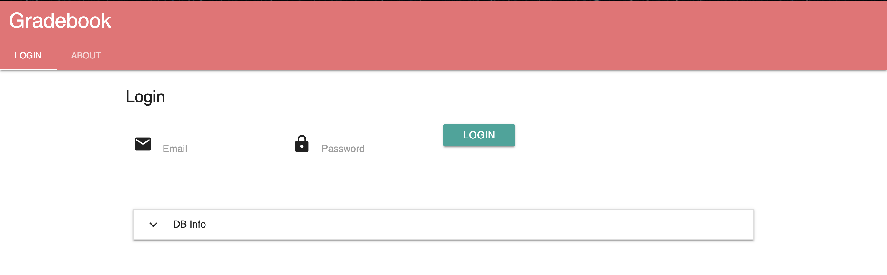  
Once you are on this screen, enter in your username and password. Click on the `Login` button to login to the system. If the login is successful you will be redirected into the system and you will see the screen that is in the next screen, otherwise, one of the following errors will be shown (Please see **Troubleshooting** for assistance with resolving the errors):
- "Domain is not recognized"
- "Username or Password is incorrect"  

After a successful login, you will see this page:
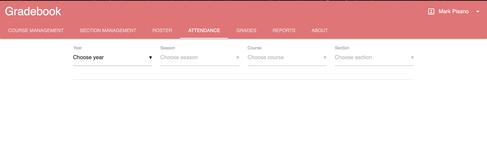  
At the current time, no work has been implemented by *Team GEEKS* in the scope of this project. The following pages have not been worked on during this project:  
- Roster
- Attendance
- Grades
- Reports  

The pages that *Team GEEKS* did work on this semester were:
- Course Management
- Section Management  
***
### Course Management
To navigate to the Course Management, click on the `Course Management` tab at the top of the page and you will be redirected to this page:
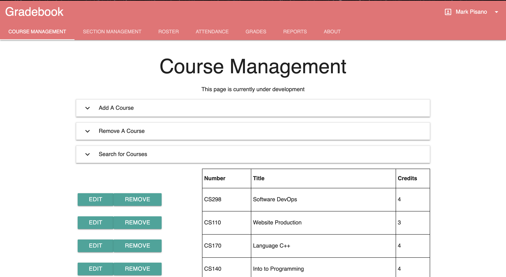  
***NOTE***: The information below the drop down menus may show different information than the picture above.  
 
There are three different drop downs on the screen that you can use to *add*, *remove* and *search* for courses. Below the drop downs, there will be a table that will update continually to keep all of the courses that are in the system displayed on the screen.
***
To *Add* a course:
1. Click on the `Add A Course` drop down to expand the menu to show all of the information needed to add a course to the system.

2. Enter in information for all of the following fields:
    1. Enter in the course name, *for Example*: `WRT100W`
    2. Enter in the title of the course, `Introduction to Writing`
    3. Enter in the number of credits that the class is, `3`
    4. Click on `Add Course` and the course will be added to the system.  

There is one error that could happen when trying to add a new course to the system:
- "The course is already represented"
***
To *Remove* a course, there are two different options:
1. Removing a course with the `Remove A Course` drop down.
    1. Click on the `Remove A Course` drop down to expand the Section
    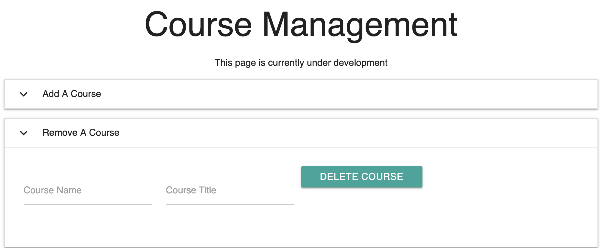
    2. Enter in the name of the course that you want to remove, `WRT100W`
    3. Enter in the title of the Course, `Introduction to Writing`
    4. Click on the `Delete Course` button to remove the course from the system.
2. Removing a course with the `Remove` button next to the course in the list of courses in the system.
    1. Find the course that you want to remove in the list of courses.
    2. Next to the name of the course, click on the `Remove` button. After about a second the course will disappear from the list to show that it was removed.  

There is one error that can happen when trying to remove a course from the system:
- "There is no course represented in the Database"  
***
To *Edit* A course that is in the Database:
1. Find the course in the list of courses
2. Click on the `Edit` button
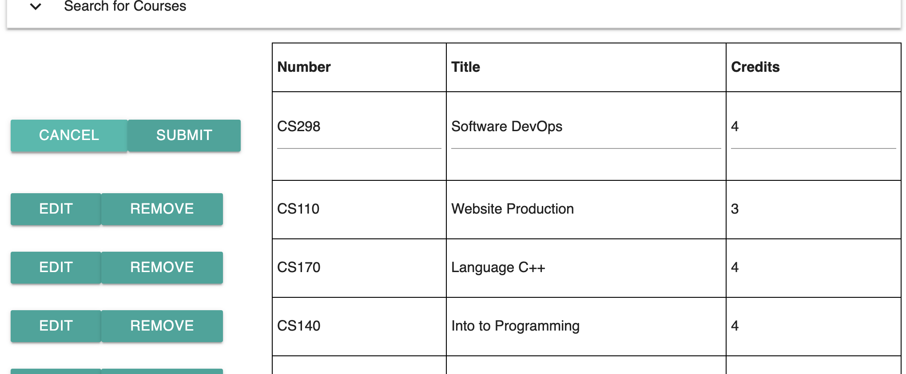
3. Make any changes that are needed to the information that is on that row.
4. Click on `Submit` to save any changes that you wanted to make or click on `Cancel` anytime to revert the changes back to what they originally were.  
***
### Section Management  
To navigate to the Section Management portion of the site, click on the `Section Management` tab at the top of the screen and you will be redirected to this page:
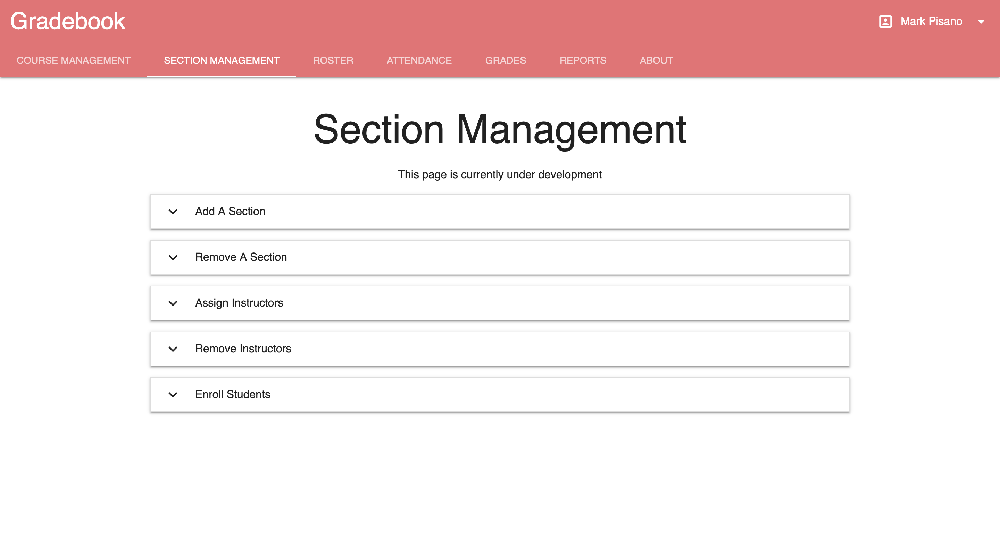
From here, you can choose to do any of the following actions that are shown above while on this screen.  
***
To *Add* A section to the system:
1. Click on the `Add A Section` drop down menu to expand it so you can see all of the input fields.
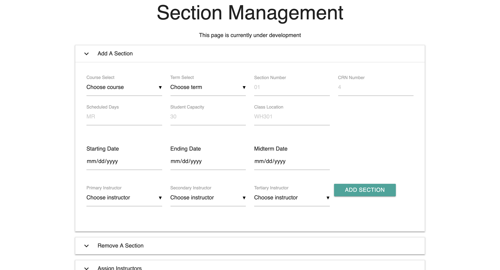
2. Fill in all of the input fields by either choosing an option from the drop down selection boxes, inputting the required text into a text input or by entering a date into the three fields that require dates.
    1. ***NOTE***: The dates that are supplied into the fields: `Starting Date`, `Ending Date` and `Midterm Date` all need to be valid dates that are in the `Term` that you choose.
3. Once all of the fields are filled in and all of the information is correct, click on the `Add Section` button to submit all of the changes to the Database to be added.  
<!--Information about errors needs to be added here-->
***
To *Remove* A section from the system, there are two different ways to remove a section, similar to the ways mentioned in *Course Management*
1. Option 1
    1. Click on the `Remove A Section` drop down to expand all of the information that is in the drop down.
    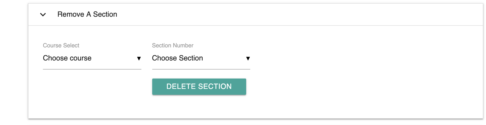
    2. Choose both the Course and the Section you want to remove from their respective option menus.
    3. Once both of the fields are filled in, click on the `Delete Section` button to remove the section from the Database.
2. Option 2
<!--This option needs to be added once the dynamically populated table is created for Sections. Also, error messages need to be added for both options once they are known.-->
***
To *Assign* Instructors to a Section:
1. Click on the `Assign Instructors` drop down menu to expand all of the information that is inside this section.
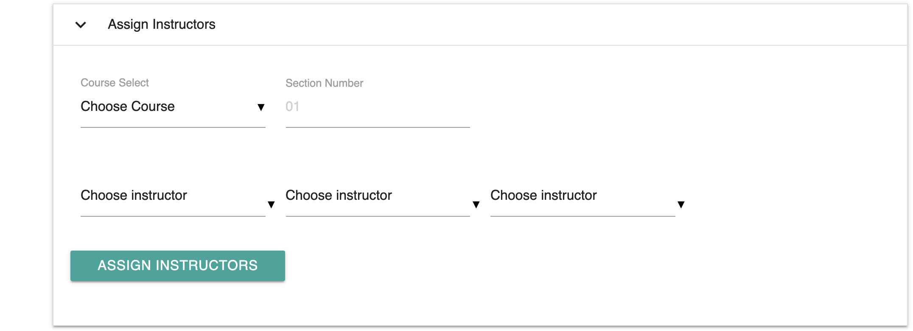
2. Choose the Course and enter in the section number that you want to add instructors to.
3. From the three drop down selections, choose at least the first instructor for the Section because that field cannot be left empty. For the other 2 fields, the instructor can be left as blank if there is not more than one instructor in a given class.
4. Once all of the fields that are needed are filled in and the information is correct, click on the `Assign Instructors` button to submit the information to the database.
***
To *Remove* Instructors from a Section:
1. Click on the `Remove Instructors` drop down menu to expand the information in the menu.
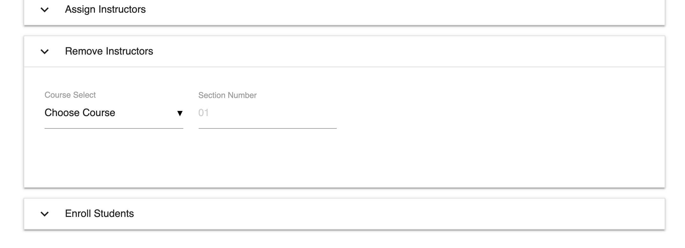
2. From within the same drop down menu, choose the Course and Section that you want to make the changes to.
<!--This needs to be added once the table is created. Also error information needs to be added to create troubleshooting guide. NOTE: A new Screenshot should be taken once the table is created here.-->
***
To *Enroll* Students into a section:
1. Click on the `Enroll Students` drop down to expand all of the information that is in the section.
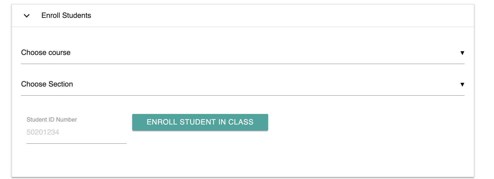
2. Choose the course and section from the drop down selection menus
3. Enter in the Student's ID Number in the last field (Example: *50205678*)
4. Once all of the information is filled in and verified, click on the `Enroll Student In Class` button to submit the information.  

***NOTE***: At the current time, there is no way to enroll multiple students into a section at a time. It is a one student at a time process as of *5/7/2019*  
<!--Error information and other supporting materials will be added when they are available.-->
***
To *Logout* of Gradebook:
1. At any time, click on the down arrow next to your name at the top right hand corner of the screen.
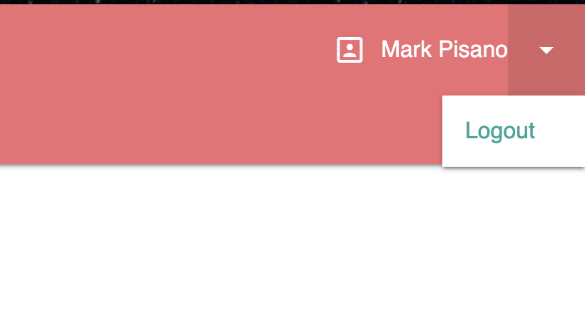
2. Click on the `Logout` option.
3. You will be redirected back to the login screen.
***
<!--More content will be added once it is added to the program. It will be added here.-->
## Troubleshooting
<!--This section is not written yet. This section will contain all of the troubleshooting information that End Users would need to know to be able to handle some of the issues that could happen when working on Gradebook.-->
This section will help to resolve some of the more common issues with Gradebook when using the product. If issues still persist after going though this guide, then reach out to your System Administrator for assistance.  

|           **Issue**         |             **Troubleshooting Steps**         |
|-----------------------------|-----------------------------------------------|
| Email Domain Not Recognized | 1. Check to make sure that there are no spelling errors in the domain of the email address.   2.Conatact your System Administrator and check to see if the domain has been properly changed from the default value. |
| Username is not Recognized. | 1. Check and verify that the email address that you are using is the same as the email assigned to you by your institution.   2. Verify with an administrator that you have an account in the system.
